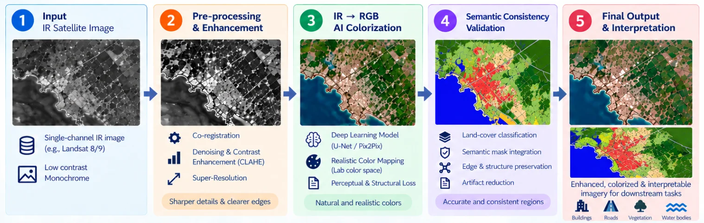

<div>

<div align="center">
<h1>🛰️ IRVision</h1>
</div>

**Colorization and semantic validation of thermal-infrared satellite imagery**

[](https://www.python.org/)
[](https://pytorch.org/)
[](https://developer.nvidia.com/cuda-toolkit)
[](https://nextjs.org/)
[](https://fastapi.tiangolo.com/)
[](https://streamlit.io/)
[](#-development)
[](https://www.usgs.gov/landsat-missions)
[](#-installation)

</div>

IRVision takes a single-band **thermal-infrared (IR) satellite image** and produces an
enhanced, **colorized RGB image**. It then checks whether the colorized image still shows
the same land cover as the real scene. It is trained and evaluated on Landsat 8/9 imagery,
including a city it never saw during training.

> **Note:** The colorized output is a learned, plausible reconstruction of true colour, not a
> physical measurement of it.


---

## 📑 Table of Contents

1. [Installation](#-installation)
2. [Quick Start](#-quick-start)
3. [Project Overview](#-project-overview)
4. [Data](#-data)
5. [Using IRVision](#-using-irvision)
6. [Models and Training](#-models-and-training)
7. [Evaluation and Results](#-evaluation-and-results)
8. [Demo Guide](#-demo-guide)
9. [Web App and Deployment](#-web-app-and-deployment)
10. [Project Structure](#-project-structure)
11. [Design Decisions](#-design-decisions)
12. [Limitations](#-limitations)
13. [Troubleshooting](#-troubleshooting)
14. [Development](#-development)
15. [Future Work](#-future-work)
16. [Acknowledgements](#-acknowledgements)

---

## ⚙️ Installation

### Requirements

| | Minimum | Tested with |
|---|---|---|
| Python | 3.10 | 3.13 |
| GPU | optional (CPU works, training is ~10× slower) | NVIDIA RTX 4050 Laptop, 6 GB |
| Disk | ~3 GB (environment, data, models) | |
| OS | Windows, Linux or macOS | Windows 11 |
| Internet | needed once, to download data and pre-trained models | |

### Step 1: Create a virtual environment

```bash
python -m venv .venv
```

```bash
# Windows (PowerShell)
.venv\Scripts\activate

# Linux / macOS
source .venv/bin/activate
```

### Step 2: Install PyTorch

Install PyTorch **before** the other requirements, from the official index that matches your hardware:

```bash
# NVIDIA GPU (CUDA 12.8)
pip install torch==2.11.0 torchvision==0.26.0 --index-url https://download.pytorch.org/whl/cu128

# CPU only
pip install torch==2.11.0 torchvision==0.26.0 --index-url https://download.pytorch.org/whl/cpu
```

> [!IMPORTANT]
> On Windows, a plain `pip install torch` installs a **CPU-only** build, even on machines with
> an NVIDIA GPU. That's why PyTorch is not listed in `requirements.txt`.

### Step 3: Install the project

```bash
pip install -r requirements.txt
pip install -e .
```

GDAL is bundled with the `rasterio` wheel, so no separate GDAL installation is needed.

### Step 4: Verify

```bash
python -c "import torch; print('CUDA available:', torch.cuda.is_available())"
pytest
```

With a GPU, the first line must print `True`. All 88 tests should pass in about 25 seconds;
they use small synthetic data and need no network access.

### Step 5: Download data and build the models

If you received the project with `data/` and `outputs/` already filled in, skip to
[Quick Start](#-quick-start). Otherwise, run these once. They take about 1.5 hours in total,
mostly training.

```bash
python scripts/download_pretrained.py    # pre-trained EDSR, YOLOv8-OBB and VGG19 weights
python scripts/download_landsat.py       # 10 Landsat scenes (cropped), ~2 min
python scripts/download_landcover.py     # ESA WorldCover land-cover labels, ~2 min
python scripts/prepare_dataset.py        # alignment, masking, normalization, patches, ~10 min
python scripts/evaluate_baseline.py      # fit and score the simple baselines, ~1 min
python scripts/train.py --run-name unet_l1_ssim_9city   # colorization model, ~25 min on GPU
python scripts/train_segmenter.py        # land-cover model for validation, ~4 min
python scripts/evaluate_model.py         # colorization results, ~3 min
python scripts/evaluate_semantic.py      # semantic validation results, ~3 min
python scripts/evaluate_advanced.py      # super-resolution and detection results, ~10 min
python scripts/export_demo.py            # ready-to-upload demo images
```

---

## 🚀 Quick Start

### Web app (recommended)

```bash
# terminal 1: model server
.venv\Scripts\python.exe -m uvicorn irvision.api.server:app --port 8000

# terminal 2: website
cd web
npm install
echo NEXT_PUBLIC_API_URL=http://localhost:8000 > .env.local
npm run dev
```

Open **http://localhost:3000**, scroll to **Try it**, choose a scene and press **Run pipeline**.
Without the model server, the site runs in demo mode with pre-computed real results.

### Streamlit dashboard (internal tool)

Always start the dashboard with the project's own Python environment:

```bash
# Windows
.venv\Scripts\python.exe -m streamlit run app/streamlit_app.py

# Linux / macOS
.venv/bin/python -m streamlit run app/streamlit_app.py
```

Then open **http://localhost:8501**, select **Example Landsat scene → hyderabad (held-out)** in
the sidebar, and press **▶ Process**.

---

## 🔭 Project Overview

### The problem

Thermal-infrared sensors record surface temperature. They work day and night and see through
haze, but a single-band thermal image is hard for people to interpret. IRVision learns the
relationship between Landsat's thermal band and its visible bands (red, green, blue). This
lets it present any thermal image as a familiar colour image, and it measures how trustworthy
that colour image is.

### Pipeline

```text
Thermal IR image (any size, any unit)
   │
   ├─ 1. Validation         single band, size limits, no-data masking
   ├─ 2. Normalization      robust 2–98 % percentile stretch
   ├─ 3. Enhancement        CLAHE local contrast enhancement (16-bit)
   ├─ 4. Super-resolution   optional · pre-trained EDSR ×2
   ├─ 5. Colorization       U-Net trained on Landsat (thermal → RGB)
   ├─ 6. Semantic map       land-cover segmentation of the colorized image
   ├─ 7. Object detection   optional · pre-trained YOLOv8-OBB (aerial imagery)
   └─ 8. Metrics            PSNR, SSIM, semantic agreement, detection consistency, timing
```

### Key features

| | Feature | Details |
|---|---|---|
| 🎨 | **Thermal → RGB colorization** | U-Net (7.8 M parameters) trained on 9 cities; beats every non-learned baseline on structural similarity |
| 🗺️ | **Semantic validation** | A land-cover model checks whether the colorized image shows the same water, vegetation and urban areas as reality |
| 🔍 | **Enhancement** | CLAHE contrast enhancement; optional EDSR ×2 super-resolution |
| 🎯 | **Object detection** | Optional YOLOv8-OBB trained on aerial imagery, with a consistency check against the real image |
| 🧪 | **Honest evaluation** | A whole city held out for testing; every reported number comes from an evaluation script |
| 🛡️ | **Robust inference** | Accepts GeoTIFF, PNG or JPEG in any unit; falls back gracefully if a model is missing |
| 📊 | **Interactive dashboard** | Streamlit app with side-by-side views, metrics, land-cover maps and a model report |

---

## 🛰️ Data

### Source

**Landsat 8/9 Collection-2 Level-2** imagery from the Microsoft Planetary Computer (free, no
account required). Only a 2048 × 2048 pixel crop (30 m per pixel, about 61 × 61 km) is
downloaded per scene, roughly 25 MB each.

| Role | Landsat band | File suffix |
|---|---|---|
| Model input | Band 10: thermal, surface temperature (Kelvin) | `ST_B10` |
| Target colour | Bands 4 / 3 / 2: red, green, blue surface reflectance | `SR_B4`, `SR_B3`, `SR_B2` |
| Cloud mask | Pixel quality flags (fill, cloud, cloud shadow) | `QA_PIXEL` |
| Land-cover labels | ESA WorldCover 2021 (10 m), merged into 5 classes | `LANDCOVER` |

### Scenes

| City | Scene ID | Date | Landscape | Use |
|---|---|---|---|---|
| Bengaluru | `LC09_L2SP_144051_20240318_02_T1` | 2024-03-18 | dense urban, lakes, dry farmland | training |
| Delhi | `LC09_L2SP_147040_20231218_02_T1` | 2023-12-18 | urban, farmland, river | training |
| Nile Delta | `LC09_L2SP_176039_20240403_02_T1` | 2024-04-03 | irrigated farmland, desert | training |
| Ahmedabad | `LC09_L2SP_149044_20240305_02_T1` | 2024-03-05 | semi-arid, urban | training |
| Kolkata | `LC09_L2SP_138045_20240104_02_T1` | 2024-01-04 | humid delta, dense vegetation | training |
| Jaipur | `LC09_L2SP_147041_20231218_02_T1` | 2023-12-18 | dry, desert margin, hills | training |
| Chennai | `LC08_L2SP_142051_20240312_02_T1` | 2024-03-12 | coastal city, sea | training |
| Nagpur | `LC09_L2SP_144045_20240130_02_T1` | 2024-01-30 | forest, farmland | training |
| Mumbai | `LC09_L2SP_148047_20240211_02_T1` | 2024-02-11 | coastal megacity, hills, sea | training |
| **Hyderabad** | `LC09_L2SP_144048_20240302_02_T1` | 2024-03-02 | urban, lakes, scrub | **test only, never used in training** |

"Training" scenes are split into train / validation / test regions (see below). Scene
locations are set in `config/config.yaml`. Scenes downloaded manually from USGS EarthExplorer
also work: place the `*_SR_B2/3/4`, `*_ST_B10` and `*_QA_PIXEL` files in `data/raw/<scene_id>/`.

### Preparation

`scripts/prepare_dataset.py` processes every scene in seven steps:

1. **Co-registration.** All bands are placed on one pixel grid, resampling only when needed.
2. **Masking.** Cloud, cloud-shadow and no-data pixels are marked invalid.
3. **Normalization.** Thermal: per-scene 2–98 % percentile stretch. Colour: fixed reflectance
   range 0–0.3, scaled to 0–1.
4. **Alignment check.** The shift between thermal and colour bands is measured and must be
   below 1 pixel. As a self-test, an artificial 7 / −4 pixel shift must also be detected
   correctly, or the scene is flagged.
5. **Enhancement.** CLAHE contrast enhancement of the thermal band.
6. **Patches.** 256 × 256 pixel patches are cut; patches with more than 5 % invalid pixels are dropped.
7. **Split.** Each training scene is divided into horizontal bands: top 70 % training, next 15 %
   validation, bottom 15 % test. No patch crosses a boundary, so no pixel appears in two sets.

**Result:** 1,297 training, 132 validation and 355 test patches (130 from the training cities'
test regions, 225 from Hyderabad). All 10 scenes pass the alignment check with a measured shift
of at most 0.16 pixels. Check figures are saved to `outputs/dataset/`.

---

## 🧭 Using IRVision

### Dashboard

```bash
.venv\Scripts\python.exe -m streamlit run app/streamlit_app.py
```

| Area | What it offers |
|---|---|
| **Input** | Choose an example Landsat scene (with crop size and position), or upload your own thermal image (GeoTIFF, 8/16-bit PNG, JPEG). Optionally add a true-colour reference image to enable accuracy metrics. |
| **Advanced stages** | Toggles for super-resolution ×2 and object detection (both off by default; see results). |
| **Result** | Original IR, enhanced IR, colorized RGB and true colour side by side; PSNR, SSIM and timing; the land-cover map of the colorized and true image with their agreement; detected objects; PNG download. |
| **Model report** | Test-set results, read directly from the evaluation output files. |

### Python API

```python
from irvision.inference.io import read_image
from irvision.inference.pipeline import process_image

ir, nodata = read_image("demo/hyderabad_farmland_ir.png")
reference, _ = read_image("demo/hyderabad_farmland_truecolor.png")

result = process_image(ir, reference_rgb=reference, nodata_mask=nodata)

result.colorized              # colorized RGB image, shape (3, H, W), values 0–1
result.enhanced               # CLAHE-enhanced thermal image (model input)
result.semantic_map           # land-cover classes of the colorized image
result.reference_semantic_map # land-cover classes of the reference image
result.detections             # detected objects (if detection is enabled)
result.metrics                # psnr, ssim, semantic agreement, timing per stage
result.warnings               # anything that was skipped or adjusted
```

Optional stages can be switched per call:
`process_image(ir, super_resolution=True, detection=True)`.

**Inputs:** thermal images from 32 to 8,192 pixels per side, in any unit (Kelvin, raw sensor
values, 8- or 16-bit). Large images are processed in overlapping tiles.

**Robustness:** if a model file is missing, IRVision continues with a simpler fallback: the
colorizer falls back to a lookup-table baseline and then to pseudo-colour, and optional stages
are skipped. Every fallback is reported in `result.warnings`. Only invalid input raises an error.

### Demo images

The `demo/` folder contains ready-to-upload examples from the held-out city. Upload the
`*_ir.png` file as the IR image and the matching `*_truecolor.png` as the reference.

| Example | Content | PSNR | SSIM | Land-cover agreement |
|---|---|---|---|---|
| `hyderabad_farmland` | 92 % cropland | 22.60 dB | 0.553 | 33.2 % |
| `hyderabad_lakes` | lakes and farmland | 19.76 dB | 0.500 | 41.9 % |
| `hyderabad_city` | 77 % built-up | 18.42 dB | 0.355 | 7.4 % |

`hyderabad_lakes_ir.tif` is the same area as a georeferenced GeoTIFF in Kelvin. The demo PNGs
store raw values, so they look dark in ordinary image viewers; the dashboard displays them correctly.

---

## 🧠 Models and Training

### Colorization model (trained in this project)

| | |
|---|---|
| Architecture | U-Net, 4 levels, 32 base channels, 7.8 M parameters |
| Input → output | 1 channel (enhanced thermal) → 3 channels (RGB) |
| Loss | L1 + SSIM (equal weights); cloud and no-data pixels excluded |
| Augmentation | Random flips and 90° rotations |
| Optimizer | AdamW (learning rate 3·10⁻⁴), cosine schedule, mixed precision |
| Training | Batch 8, 40 epochs, early stopping; best checkpoint chosen on the **validation** set |
| Deployed model | `outputs/models/unet_l1_ssim_9city/best.pt`: epoch 38, validation PSNR 24.12 dB, SSIM 0.637 (24 min) |

```bash
python scripts/train.py --run-name my_run                   # settings from config/config.yaml
python scripts/train.py --run-name quick --epochs 1         # quick check
python scripts/train.py --run-name vgg --perceptual 0.1     # add VGG19 perceptual loss
```

Each run writes its checkpoint, per-epoch history, learning curves and a summary to
`outputs/models/<run-name>/`. To use a different model, set `inference.checkpoint` in
`config/config.yaml`.

### Land-cover model (trained in this project, for validation)

DeepLabV3 with an ImageNet-pretrained MobileNetV3 backbone (11 M parameters), fine-tuned for 15
epochs on the **real** colour images of the training cities. It uses ESA WorldCover labels merged
into five classes: **tree cover, low vegetation / crops, built-up, bare ground, water**. It is used
only to measure the colorization and never sees colorized images during training. Validation mIoU: 0.489.

### Pre-trained models (not trained in this project)

| Model | Purpose | Trained on |
|---|---|---|
| EDSR-base ×2 | Optional super-resolution of the thermal image | DIV2K natural photos |
| YOLOv8n-OBB | Optional object detection | DOTA aerial imagery |
| VGG19 | Perceptual loss (experiment) | ImageNet |

---

## 📊 Evaluation and Results

All results below were produced by the evaluation scripts (stored in `outputs/results/`) on an
RTX 4050. Models and baselines were fitted on training data only, selected on validation data,
and scored on the test set. Metrics are computed on valid pixels only (clouds and no-data
excluded) and averaged over 256 × 256 test patches.

**Reading the metrics:** **PSNR** measures colour accuracy (higher is better, in dB).
**SSIM** measures structural similarity (0–1, higher is better). **Land-cover agreement**
measures how often the colorized image is classified the same as the real image.

### Colorization

| Method | All test patches (355) | Held-out city (225) | Training cities' test regions (130) |
|---|---|---|---|
| Average colour (ignores input) | 19.55 dB / 0.387 | 19.04 dB / 0.349 | 20.45 dB / 0.454 |
| Brightness-to-colour lookup table | 21.65 dB / 0.479 | **21.33 dB** / 0.434 | 22.20 dB / 0.556 |
| **IRVision U-Net** | **22.12 dB / 0.547** | 21.28 dB / **0.495** | **23.57 dB / 0.636** |

<sub>Values are PSNR / SSIM. Grayscale and classic pseudo-colour renderings score only 8–10 dB,
as they are not intended to reproduce true colour.</sub>

- **Structure:** the U-Net has the highest SSIM on every test set.
- **Colour accuracy:** clearly better in the training cities (+1.4 dB), while on the unseen city
  it matches the lookup table.
- **Full scene:** the complete 2048 × 2048 Hyderabad scene is processed in 1.6 s on the GPU
  (PSNR 20.98 dB, SSIM 0.510).

### Semantic validation

| Comparison | All test patches: mIoU / agreement | Held-out city: mIoU / agreement |
|---|---|---|
| Real image vs. WorldCover (upper limit of the land-cover model) | 0.456 / 66.1 % | 0.390 / 64.7 % |
| **U-Net colorized vs. real image** | **0.269 / 42.8 %** | **0.196 / 39.6 %** |
| Lookup table vs. real image | 0.034 / 9.2 % | 0.021 / 3.6 % |
| Average colour vs. real image | 0.058 / 15.3 % | 0.064 / 18.8 % |

- The U-Net preserves about **8× more land-cover information** than the lookup table, even
  where their colour accuracy is similar.
- Per class, agreement is strong for **water (0.74)** and moderate for **crops (0.34)** and
  **trees (0.26)**, but **built-up areas are not preserved (0.00)**: colorized cities tend to look
  like vegetation. Colour metrics alone did not reveal this.

### Advanced stages

**Super-resolution (EDSR ×2 before colorization)**, scored at the original resolution:

| | PSNR | SSIM | Land-cover mIoU |
|---|---|---|---|
| U-Net | **22.12 dB** | **0.547** | **0.269** |
| EDSR ×2 + U-Net | 19.79 dB | 0.499 | 0.149 |

Super-resolution lowers every metric: the colorization model was trained on 30 m pixels and
does not transfer to upscaled input. It remains available as an option but is off by default.

**Object detection (YOLOv8-OBB)** across all 355 test patches:

| Image | Objects detected | Matching the real image |
|---|---|---|
| Real colour image | 14 (harbours, storage tanks, ships, bridges, planes) | reference |
| U-Net colorized image | 21 (all labelled "plane") | 0 |

At 30 m per pixel most objects are only a few pixels wide, and detections on colorized images
did not match any real object. Detection is available as an option but is off by default and
should not be relied on at this resolution.

**Perceptual loss (VGG19)**, compared on the validation set:

| Loss | Validation PSNR | Validation SSIM |
|---|---|---|
| L1 + SSIM (deployed) | **24.12 dB** | **0.637** |
| L1 + SSIM + VGG19 perceptual | 24.11 dB | 0.634 |

The perceptual loss gave no measurable improvement, so the simpler model remains deployed.

---

## 🎤 Demo Guide

**Preparation:** start the dashboard and press **Process** once, so all models are loaded.

| Step | Time | What to show |
|---|---|---|
| 1. Problem | 20 s | Thermal satellites see heat day and night, but single-band IR is hard to read. |
| 2. Unseen city | 60 s | Select *hyderabad (held-out)*, crop 1024 over lakes and farmland, press **Process**. Walk through IR → enhanced → colorized → true colour and the metrics. |
| 3. Semantic check | 45 s | Show the land-cover maps: water and vegetation are preserved. Upload `demo/hyderabad_city_*` to show that dense urban areas are not (7.4 % agreement). |
| 4. Results | 30 s | Open **Model report**: best SSIM on every test set, and far higher land-cover agreement than the baselines. |
| 5. Engineering | 25 s | One inference API behind the web app, scripts and tests; graceful fallbacks; 88 automated tests. |

If anything fails during a demo, the app falls back to a simpler colorizer and shows a warning.
Backup figures are in `outputs/results/`.

---

## 🌐 Web App and Deployment

The public face of IRVision is a Next.js website (`web/`) with an animated walkthrough of the
pipeline, an interactive playground and the evaluation results. It talks to a FastAPI model
server (`irvision/api/server.py`), which wraps the same `process_image()` used everywhere else.

```text
Browser ──► Next.js website (Vercel) ──HTTPS──► FastAPI model server (Docker) ──► PyTorch models
                   │
                   └── demo mode: pre-computed real results in web/public/demo (no server needed)
```

| Mode | When | Features |
|---|---|---|
| **Demo** | `NEXT_PUBLIC_API_URL` not set, or server unreachable | All three example scenes with every stage option, real pre-computed results |
| **Live** | `NEXT_PUBLIC_API_URL` set to a running model server | Real-time processing, uploads of your own thermal images |

### Step 1: Deploy the website (Vercel)

1. Push the repository to GitHub.
2. In Vercel, **Add New → Project**, import the repository and set **Root Directory** to `web`.
3. Optional: add the environment variable `NEXT_PUBLIC_API_URL` with your model server URL
   (without a trailing slash). Leave it out for demo mode.
4. Deploy. The site is fully static, so it builds in under a minute.

### Step 2: Deploy the model server (optional, enables live mode)

The model server is packaged as a Docker image (`Dockerfile`, CPU build, about 85 MB of model files).

```bash
docker build -t irvision-api .
docker run -p 7860:7860 irvision-api        # check: http://localhost:7860/api/health
```

**Free option A: serve it from your own laptop (recommended for demos).** The model server runs on
your machine (using its GPU) and a free Cloudflare quick tunnel makes it reachable from the internet:

```powershell
winget install --id Cloudflare.cloudflared           # once
.\scripts\go_live.ps1 -Site https://your-site.vercel.app
```

The script prints a link like `https://your-site.vercel.app/?api=https://abc-xyz.trycloudflare.com`.
Opening it switches the website to live mode; the browser remembers the server, and
`?api=off` switches back to demo mode. No redeploy is needed, even though the tunnel address
changes on every start. The server is live while the script window stays open.

**Option B: Hugging Face Space (Gradio SDK), if available on your account.** The trained models are git-ignored
in this repository, so assemble a ready-to-push Space folder first:

```bash
git clone https://huggingface.co/spaces/<your-user>/irvision-api deploy/hf-space
python scripts/build_space.py            # code, config, demo images, models (86 MB), app.py
cd deploy/hf-space
git lfs install
git add . && git commit -m "Deploy IRVision model server" && git push
```

When creating the Space, choose the **Gradio** SDK and **CPU basic (free)** hardware. The generated
`app.py` starts the same FastAPI server; the Space URL is `https://<your-user>-irvision-api.hf.space`.

**Docker hosts.** `python scripts/build_space.py --sdk docker` assembles the Docker variant, and the
repository's `Dockerfile` also runs on Render, Railway, Fly.io or Google Cloud Run. The server listens
on the `PORT` variable (default 7860).

| Variable | Default | Purpose |
|---|---|---|
| `IRVISION_ALLOWED_ORIGINS` | `*` | Comma-separated website origins allowed to call the API, e.g. `https://irvision.vercel.app` |
| `IRVISION_MAX_SIDE` | `2048` | Largest accepted image side in pixels |
| `IRVISION_MAX_UPLOAD_MB` | `25` | Largest accepted upload |

### API endpoints

| Method | Path | Returns |
|---|---|---|
| `GET` | `/api/health` | Server and model status |
| `GET` | `/api/examples` | Built-in example scenes |
| `POST` | `/api/process/example/{id}` | Full pipeline result for an example (`?super_resolution=true&detection=true`) |
| `POST` | `/api/process` | Full pipeline result for an uploaded image (form fields `image`, optional `reference`) |
| `GET` | `/api/report` | Test-set results |

Interactive API documentation is available at `/docs` on the running server.

### Refreshing the demo data

After retraining or re-evaluating, regenerate the website's pre-computed results:

```bash
python scripts/export_web_demo.py
```

---

## 🗂️ Project Structure

```text
irvision/                  Python package (installed with pip install -e .)
├── preprocessing/         loading, co-registration, masking, normalization, CLAHE, patches
├── models/                baselines, U-Net, colorizer wrapper, super-resolution
├── training/              dataset, augmentation, losses (L1, SSIM, VGG19), training loop
├── semantic/              land-cover classes, segmenter, IoU / Dice metrics
├── detection/             YOLOv8-OBB detector and matching metrics
├── evaluation/            PSNR, SSIM, timing, evaluation helpers
├── inference/             process_image() pipeline and file reading
├── api/                   FastAPI model server and response builder
└── utils/                 configuration, logging, tiling, figures
web/                       Next.js website (animated pipeline, playground, results)
app/streamlit_app.py       Streamlit dashboard (internal tool)
scripts/                   command-line entry points for every step
config/config.yaml         all settings, with comments
tests/                     88 automated tests (synthetic data)
demo/                      ready-to-upload example images
Dockerfile                 container image of the model server
data/, outputs/            generated data, models and results (not version-controlled)
```

See **[ARCHITECTURE.md](ARCHITECTURE.md)** for data flow, interfaces and extension points.

---

## 🧩 Design Decisions

| ID | Decision | Reason |
|---|---|---|
| D-001 | All code in one installable package (`irvision/`) | Imports work the same from scripts, tests and the app. |
| D-002 | Landsat Level-2 from the Planetary Computer, cropped download | Free access, physical units, ~25 MB per scene instead of ~1 GB. |
| D-004 | Thermal: per-scene percentile stretch. Colour: fixed reflectance range | Temperature ranges vary strongly by place and season; a fixed colour range keeps targets consistent. |
| D-005 | 16-bit contrast enhancement on whole scenes | Preserves subtle thermal differences; consistent across patches. |
| D-006 | Spatial train / validation / test split without overlap | Prevents any pixel from appearing in two sets. |
| D-007 | Alignment is measured and self-tested | A check that cannot fail proves nothing. |
| D-008 | Crops are moved inside the valid scene area | Avoids large no-data regions at scene edges. |
| D-010 | Simple baselines, including an "average colour" floor | Shows what a score means; an average colour alone reaches ~19–20 dB. |
| D-011 | One evaluation routine for every method | All results are directly comparable. |
| D-012 | A whole city held out for testing | Measures performance on truly unseen places. |
| D-014 | Missing models never stop the pipeline | Fallbacks and optional stages that skip safely. |
| D-015 | The dashboard contains no processing logic | App, scripts and tests share the same code and results. |
| D-016 | PyTorch installed separately from `requirements.txt` | Avoids silently installing a CPU-only build. |
| D-017 | Nine training cities instead of three | Three cities led to a colour bias on unseen places. |
| D-018 | L1 + SSIM loss with a single thermal input | SSIM improved structure; an absolute-temperature input gave no real gain. |
| D-019 | Object detection optional and off by default | At 30 m per pixel, detections on colorized images did not match real objects. |
| D-020 | Super-resolution optional and off by default | It lowered every metric on this data. |
| D-021 | Land-cover validation model trained on real Landsat imagery | Models trained on everyday photos do not transfer to 30 m satellite pixels. |
| D-022 | Perceptual loss not adopted | No improvement on the validation set. |

---

## ⚠️ Limitations

- **Urban areas:** built-up land is not preserved in the colorized output and tends to look
  like vegetation. Do not use the output to judge urban extent.
- **Unseen locations:** colour accuracy on a new city is similar to a simple lookup table;
  the model's advantage there is structure and land-cover consistency.
- **Resolution:** Landsat's thermal band is natively 100 m (delivered at 30 m), so fine detail in
  the output is inferred, not observed.
- **Dataset scope:** 10 scenes, mostly Indian cities in the dry season (December–April). Expect
  weaker results for monsoon, snow or very different regions.
- **Relative temperature:** each image is normalized on its own, so the model sees relative, not
  absolute, temperature.
- **Bright surfaces:** reflectance above 0.3 (e.g. snow, white roofs) is clipped.
- **Land-cover model:** its own accuracy is moderate (validation mIoU 0.49), so land-cover scores
  are best used to compare methods.
- **Single crops vary:** quote averages over many patches rather than one crop.

---

## 🛠️ Troubleshooting

| Symptom | Solution |
|---|---|
| "Super resolution skipped / Detection skipped: No module named ..." | The app is running on the system Python. Start it with `.venv\Scripts\python.exe -m streamlit run app/streamlit_app.py`. |
| Training runs on CPU / "CUDA not available" | A CPU-only PyTorch is installed. Repeat [Installation step 2](#step-2-install-pytorch). |
| `ModuleNotFoundError: irvision` | Run `pip install -e .` inside the virtual environment. |
| "Using fallback colorizer 'lut'" | The file in `inference.checkpoint` is missing. Train a model or correct the path. |
| "Semantic segmentation skipped" | Run `python scripts/train_segmenter.py`. |
| `CUDA out of memory` | Close other GPU programs (`nvidia-smi`) or lower `training.batch_size`. |
| App does not reflect code changes | Clear the Streamlit cache (☰ menu → Clear cache) or restart the app. |
| Download fails with HTTP 403 | The data access token expired. Re-run the script; finished scenes are skipped. |
| Alignment check fails | Inspect `outputs/dataset/<scene>_overview.png` before using the scene. |

---

## 👩‍💻 Development

### Conventions

- **Configuration:** every setting lives in `config/config.yaml` and is read with `load_config()`.
- **Structure:** scripts only parse arguments; all logic lives in the `irvision` package.
- **Arrays:** images are `(channels, height, width)` in the range 0–1; masks are `True` for valid pixels.
- **Evaluation:** fit on training data, select on validation data, report on test data, including the held-out city.
- **Errors:** invalid input raises a clear error; optional components fail safely.

### Tests

```bash
pytest
```

88 tests, about 25 seconds, no network or real data required. They cover data loading,
alignment, masking, normalization, enhancement, patching, all models and losses, the training
loop, metrics, the inference pipeline and its fallbacks, super-resolution, detection, file
reading and the dashboard.

### Extending the project

| Goal | Where to start |
|---|---|
| Add a training city | `dataset.download.aois` in the config, then download → land cover → prepare |
| Try a new loss | `irvision/training/losses.py`, then train and run the evaluation scripts |
| Use a different model | Any class with `colorize(ir)` works with the pipeline and evaluation |
| Change land-cover classes | `irvision/semantic/landcover.py` |

---

## 🔮 Future Work

1. **Urban areas:** add a land-cover-aware loss and more urban training scenes.
2. **More diverse data:** other seasons, climates and continents; going from three to nine
   cities was the largest single improvement so far.
3. **Colour modelling:** experiment with the Lab colour space and adversarial refinement.
4. **Higher-resolution imagery:** revisit super-resolution and object detection with sensors
   finer than 30 m.

---

## 🙏 Acknowledgements

- **Landsat 8/9** imagery courtesy of the U.S. Geological Survey, accessed through the
  [Microsoft Planetary Computer](https://planetarycomputer.microsoft.com/).
- **ESA WorldCover 2021** land-cover map © ESA WorldCover project, contains modified Copernicus
  Sentinel data.
- Pre-trained models: **EDSR** via [super-image](https://github.com/eugenesiow/super-image),
  **YOLOv8** via [Ultralytics](https://github.com/ultralytics/ultralytics), **VGG19** and
  **DeepLabV3 / MobileNetV3** via [torchvision](https://pytorch.org/vision/).
